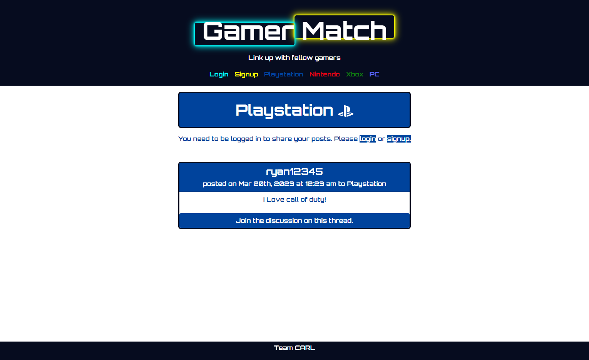

# Gamer-Match

## Description 

This application serves as a social media site for gamers! Users can log in securely with their name, email, and password to create an account. Once logged in, a user is prompted to save their personal preferences to their profile. Users can post and comment within varios channels representing popular gaming platforms, as well as view other people's profiles. When viewing another user's profile, the logged in user can add them as a friend. A user's personal profile has sections that display their playstyle, favorite console(s), friend's list, and the various posts they've made throughout the channels. 

## Table of Contents: 

* [Installation](#installation)

* [Usage](#usage)

* [Contributing](#contributing)

* [Questions](#questions)


## Installation

Ensure MongoDB is installed locally before downloading the repository: https://www.mongodb.com/try/download/community

To install necessary dependencies, run the following command:

```
npm i
```

## Usage

Clone the repository into the local directory of your choosing. Ensure you have MongoDB downloaded to your device. Create a .env file with two variables: "MY_SECRET" and 
"EXPIRATION". Set a secret password and expiration time (i.e. "1h", "2h"). Then, execute the command "npm run develop" to launch the application. If you are a new user, click the "Signup" link in the navigation bar. Plug in your username, email, and password into the required fields and answer the questions about your gaming preferences. After being redirected, you can navigate to one of the listed channels and either submit a post or click on an existing post to view that user's profile. 

Alternatively, you can access the deployed application on Heroku: https://peaceful-brook-99319.herokuapp.com/




## Contributing

Contact ryan.taylor1@yahoo.com, cobi.gottschalk@gmail.com, antfar67@gmail.com, louyoon89@gmail.com to contribute to the repo!

## Questions

If you have any questions about the repo, open an issue or contact us directly at ryan.taylor1@yahoo.com, cobi.gottschalk@gmail.com, antfar67@gmail.com, louyoon89@gmail.com.